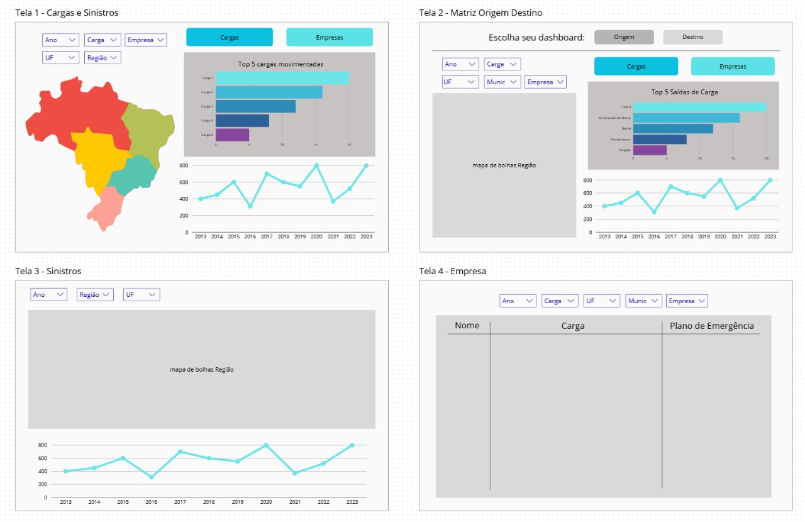

# 📌 MVP - SprintCoders

## 🎯 Objetivo do MVP

> O MVP tem como objetivo validar a criação de um **dashboard interativo em Power BI** voltado à análise de dados do **transporte de cargas especiais e perigosas**, incluindo informações sobre sinistros de trânsito relacionados às empresas transportadoras.

### 🧩 Problema que resolve
Falta de uma ferramenta unificada e visual para análise dos dados de transporte de cargas especiais e perigosas, e sinistros de trânsito relacionados às empresas transportadoras.

### 💡 Hipótese a ser validada
Um dashboard interativo em Power BI facilita a compreensão dos indicadores e apoia decisões estratégicas.

### 🚀 Valor entregue ao usuário
Visualização clara e dinâmica de métricas como principais cargas, modais, origens, destinos e tendências, auxiliando na gestão e formulação de políticas públicas.

---

## 📝 Descrição da Solução

> Nesta etapa, será desenvolvido um **protótipo funcional do dashboard interativo**, utilizando dados do **IBAMA (2013–2023)** sobre cargas químicas e perigosas.

### ⚙️ Funcionalidades principais
- Coleta, limpeza e organização dos dados em um *dataframe* consolidado.  
- Visualização inicial do dashboard em Power BI, com gráficos e indicadores básicos.  
- Estruturação de métricas por estado e em nível nacional.  

### ⚠️ Limitações conhecidas
- O MVP apresenta apenas indicadores iniciais, sem filtros avançados ou atualização automática.  
- Base de dados limitada ao período de 2013 a 2023.  

### 🎯 Escopo reduzido
- O foco é validar a integração e a visualização dos dados em um único ambiente, priorizando clareza, funcionalidade básica e viabilidade técnica.

---

## 👥 Personas / Usuários-Alvo
- **IPEM:** Instituto de Pesos e Medidas  breve descrição, necessidades e dores atendidas  
- **Persona 2:** breve descrição, necessidades e dores atendidas  

---

## 🔑 User Stories (Backlog do MVP)

| ID  | User Story                                                                                                                       | Prioridade | Estimativa  |
|-----|----------------------------------------------------------------------------------------------------------------------------------|------------|-------------|
| US1 | Como cliente, quero acessar os dados do IBAMA de 2013 a 2023 para compreender as informações disponíveis sobre cargas perigosas. | Alta       | 5 pontos    |
| US2 | Como cliente, quero visualizar um protótipo básico do dashboard final para avaliar a estrutura e funcionalidades iniciais.       | Média      | 3 pontos    |
| US3 | Como cliente, quero visualizar os dados do IBAMA sobre cargas químicas e perigosas em um dataframe.                              | Alta       | 5 pontos    |
| US4 | Como cliente, quero que os dados de 2013 a 2023 sobre cargas químicas e perigosas estejam agrupados em um único dataframe.       | Média      | 3 pontos    |

---

## 📅 Sprint(s) Relacionadas
| Sprint | Entregas Principais                          | Status   |
|--------|----------------------------------------------|----------|
| 01     | Coleta e Estruturação de Dados IBAMA         | Concluído|
| 02     | Protótipo do Dashboard Power BI              | Em andamento |

---

## 📊 Critérios de Aceitação
- O MVP deve permitir que o usuário visualize a estrutura do database que será utilizado no projeto, além de um protótipo do dashboard.
- O sistema deve registrar as informações de cargas perigosas e sinistros de trânsito.
- Métricas coletadas: Quantidade de Cargas, Peso, Número de Empresas, Matriz OD, Quantidade de Sinistros, Localidade dos Sinistros e Localidade dos PPD's. 

---

## 📈 Métricas de Validação
- Feedback qualitativo: foi positivo, indicando o que foi desenvolvido e orientando nos pontos a melhorar.

---

## 🚀 Próximos Passos
- Prosseguir com o desenvolvimento do projeto incrementando todo o conteúdo realizado
  
---

## 📂 Anexos / Evidências
- Protótipo inicial do dashboard

- Vídeo (MVP)

 
